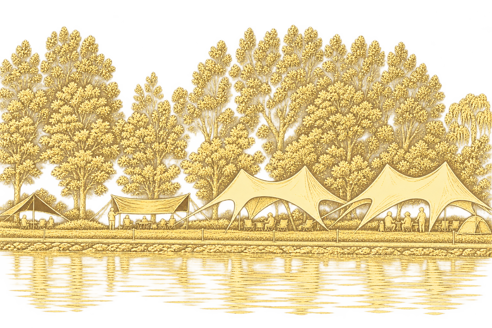

# 实景金色版画 · Scene to Gold Print

将现实场景照片或指定主体转成透明底金色版画素材。适合建筑、室内、园林、街景、自然景观、营地和活动门架等题材。

这是供支持 Skills 的 AI 助手使用的技能包，不是独立图像处理软件。生成流程依赖 imagegen 技能及对应图像生成能力。

## 两种风格

| 风格 | 特点 |
| --- | --- |
| 丰富刻线版 | 保留更多结构、草木、水纹等刻线细节 |
| 疏朗留白版 | 减少内部刻线，强调轮廓和透明留白 |

可以选择一种，也可以从同一原照片分别生成两种。没有选择风格时，技能会先询问。

### 丰富刻线参考



### 疏朗留白参考


参考图只用于线条和风格，不应复制其中的建筑、人物或场景。参考图可能包含背景光晕或透明边缘瑕疵，这些不是目标效果。

## 安装

下载仓库 ZIP 并解压，将包含 SKILL.md、agents 和 assets 的目录命名为 scene-to-gold-print，放入个人技能目录：

- Windows：%USERPROFILE%\.codex\skills\scene-to-gold-print
- macOS / Linux：~/.codex/skills/scene-to-gold-print
- 若设置了 CODEX_HOME，则使用该目录下的 skills/scene-to-gold-print。

保留全部 assets 文件。不要把 GitHub 下载 ZIP 的额外外层目录误当成技能目录。安装后在后续对话中调用；其他支持 Skills 的工具请按其安装方式操作。

## 使用示例

上传照片后输入：

> 使用实景金色版画，丰富刻线版。

> 使用实景金色版画，主体是前景的红色活动门架，疏朗留白版。

> 实景金色版画，两种都生成。

也可以使用标识 `$scene-to-gold-print`。

## 核心行为

- 原照片决定结构、比例、视角和空间关系，参考图只决定风格。
- 支持按名称、颜色、位置或标记选择主体；门洞等真实空隙设为透明。
- 无法准确生成的文字可以省略，保留其标牌或支撑结构。
- 交付前在白底和深色底上检查可见杂色、光晕、残留背景和主体透明度。
- 不把接近不透明的像素误判为透底，也不把完全透明像素的隐藏颜色当成可见杂边。

## 文件结构

```text
SKILL.md
agents/openai.yaml
assets/accepted-hotel-style.png
assets/variant-1-detailed-lakeside.png
assets/variant-2-airy-lakeside.png
assets/icon.svg
```

## 输出与限制

输出目标为含真实透明通道的 PNG。生成结果可能需要针对性修正；存在未解决问题时应明确标注为预览。图片尺寸取决于生成结果，不保证任意尺寸印刷或严格单专色分色。使用者需自行提供有权处理的照片。

## 授权

本项目的技能说明和配置文件采用 [MIT License](LICENSE)，允许使用、修改、再分发和商业使用，须保留版权声明及许可证。

参考图片的授权范围另行说明。本许可证不授予第三方商标、肖像或其他第三方内容的权利，也不保证使用本技能生成的图片自动适用于所有商业用途。
